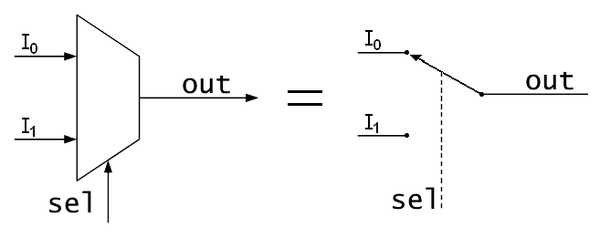

[Back to index](/Readme.md)

# Chapter 2

## Logic Circuits

Composed of

- Inputs
- Outputs
- Functional specification
- Timing specification

### Nodes

#### Inputs

- A
- B
- C

#### Circuit Elements

- E1
- E2
- E3
- Each represent a circuit

#### Combinational Logic

Has no memory, determines outputs by the current values of the inputs

#### Sequential Logic

Has memory, determines outputs by previous and current values of inputs

#### Combinational Composition

A circuit is combinational if it consists of interconnected circuit elements such that:

[x] Every element is combinational
[x] Every node is either an input or connects to _exactly one_ output
[x] The circuit contains no cyclic paths

#### Complement

The negation of a variable

#### Literal

A variable or its complement

#### Implicant

The product of at least 2 literals

#### Minterm

The product of all input literals

#### Maxterm

The summation of all input literals

### Sum of products form

| A   | B   | Y   | minterm | minterm name |
| --- | --- | --- | ------- | ------------ |
| 0   | 0   | 0   | ~A~B    | m0           |
| 0   | 1   | 1   | ~AB     | m1           |
| 1   | 0   | 0   | A~B     | m2           |
| 1   | 1   | 1   | AB      | m3           |

### Product of sums form

| A   | B   | Y   | maxterm | maxterm name |
| --- | --- | --- | ------- | ------------ |
| 0   | 0   | 0   | A+B     | M0           |
| 0   | 1   | 0   | A+~B    | M1           |
| 1   | 0   | 0   | ~A+B    | M2           |
| 1   | 1   | 0   | ~A+~B   | M3           |

## Example

You are going to the cafeteria for lunch.

- You won't eat lunch (E) is false
- If it's not open (O) is false or
- If they only serve corndogs (C) is true

Write a truth table for determining if you will eat lunch
| O   | C   | E   |
| --- | --- | --- |
| 0   | 0   | 0   |
| 0   | 1   | 0   |
| 1   | 0   | 1   |
| 1   | 1   | 0   |

## Priority Circuit

Output asserted correspnding to most significatnt true digit
| A2  | A1  | A0  | Y2  | Y1  | Y0  |
| --- | --- | --- | --- | --- | --- |
| 0   | 0   | 0   | 0   | 0   | 0   |
| 0   | 0   | 1   | 0   | 0   | 1   |
| 0   | 1   | 0   | 0   | 1   | 0   |
| 1   | 0   | 1   | 1   | 0   | 0   |

### Don't cares

Use an x in the truth table where the value doesn't mattern

## Karnaugh Maps (K-Maps)

- Boolean expressions can be minimized by combining terms
- K-maps minimize equations graphically
- More important, they give insight into manipulating boolean equations

#### Rules

- Every 1 must be circled at least once
- Each circle must span a rectangular block that is a power of 2 squares in each direction
- Each circle must be as large as possible
- A circle may wrap around the edges
- A 1 in K-map may be circled multiple times if doing so allows fewer circles to be used
- A "don't care" `(X)` is circuled only if it helps minimize the equation

|     |     |     |     |
| --- | --- | --- | --- |
| 1   | 0   | 0   | 1   |
| 0   | 1   | 0   | 1   |
| 1   | 1   | 0   | 0   |
| 1   | 1   | 0   | 1   |

```
A~B~C~D
A~B~C D
-------
A~B~C
```

```
~A~B C D
~A B C D
~A~B C~D
~A B C~D
--------
~A   C
```

```
~A B~C D
~A B C D
--------
~A B   D
```

```
 A~B~C~D   A~B C~D
~A~B~C~D  ~A~B C~D
--------  --------
  ~B~C~D    ~B C~D

~B~C~D
~B C~D
------
~B  ~D
```

```
A~B~C + ~AC + ~ABD + ~B~D
```

### Practice

|     | 00  | 01  | 11  | 10  |
| --- | --- | --- | --- | --- |
| 00  | 1   | 0   | 0   | 1   |
| 01  | 0   | 1   | 0   | 1   |
| 11  | 1   | 1   | 0   | 0   |
| 10  | 1   | 1   | 0   | 0   |

1. 1,3 - 2,4
2. 1,1 - 4,1
3. 4,1 - 4,2
4. 2,2 - 2,3

```
~A~B C D
~A B C D
~A~B C~D
~A B C~D
--------
~A   C

~A~B~C~D
 A~B~C~D
--------
  ~B~C~D

 A~B~C~D
 A~B~C D
--------
 A~B~C

~A B~C D
~A B C D
--------
~A B   D

Y = ~AC + ~B~C~D + A~B~C + ~ABD
```

|     | 00  | 01  | 11  | 10  |
| --- | --- | --- | --- | --- |
| 00  | 1   | 1   | 0   | 1   |
| 01  | 1   | 0   | 0   | 1   |
| 11  | 1   | 1   | 0   | 0   |
| 10  | 1   | 0   | 0   | 0   |

1. 1,1 - 1,2
2. 1,1 - 4,2
3. 1,1 - 1,4
4. 1,3 - 2,3

```
~A~B~C~D
~A B~C~D
--------
~A  ~C~D

~A~B~C~D
~A~B~C D
 A~B~C~D
 A~B~C D
--------
  ~B~C

~A~B~C~D
~A~B~C D
~A~B C D
~A~B C~D
--------
~A~B

~A~B C D
~A B C D
--------
~A   C D

Y = ~A~C~D + ~B~C + ~A~B + ~ACD
```

|     | 00  | 01  | 11  | 10  |
| --- | --- | --- | --- | --- |
| 00  | 1   | 0   | X   | 1   |
| 01  | 0   | X   | X   | 1   |
| 11  | 1   | 1   | X   | X   |
| 10  | 1   | 1   | X   | X   |

1. 4,1 - 1,4 - 4,4 - 1,1
2. 1,3 - 4,4
3. 3,1 - 4,4

|     | 00  | 01  | 11  | 10  |
| --- | --- | --- | --- | --- |
| 00  | 1   | 1   | X   | 1   |
| 01  | 1   | 0   | X   | 1   |
| 11  | 1   | 1   | X   | X   |
| 10  | 1   | 0   | X   | X   |

1. 1,1 - 4,4 (wrapped)
2. 1,3 - 4,3
3. 1,1 - 4,1

## Circuits

### Multiplexers

Combinational circuit

2:1 Mux


Selects between one of _N_ inputs to connect to output

Example:
| S   | D1  | D0  | Y   |
| --- | --- | --- | --- |
| 0   | 0   | 0   | 0   |
| 0   | 0   | 1   | 1   |
| 0   | 1   | 0   | 0   |
| 0   | 1   | 1   | 1   |
| 1   | 0   | 0   | 0   |
| 1   | 0   | 1   | 0   |
| 1   | 1   | 0   | 1   |
| 1   | 1   | 1   | 1   |

The value of Y is dependent on the current state of `S`, then uses the appropriate connector corresponding to the singal value.

The truth table can be minimized to:

| S   | Y   |
| --- | --- |
| 0   | D0  |
| 1   | D1  |


Karnaugh Map:
|     | 00  | 01  | 11  | 10  |
| --- | --- | --- | --- | --- |
| 0   | 0   | 0   | 1   | 1   |
| 1   | 0   | 1   | 1   | 0   |

Y = D0~S + D1S


### Decoders

N inputes, 2^N outputs

Takes binary representation and gives output on wire representing decimal value

| A1  | A0  | Y3  | Y2  | Y1  | Y0  |
| --- | --- | --- | --- | --- | --- |
| 0   | 0   | 0   | 0   | 0   | 1   |
| 0   | 1   | 0   | 0   | 1   | 0   |
| 1   | 0   | 0   | 1   | 0   | 0   |
| 1   | 1   | 1   | 0   | 0   | 0   |